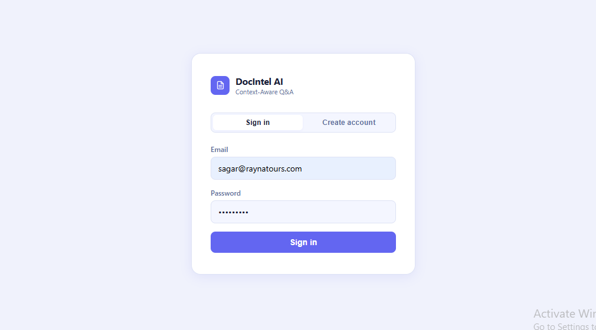
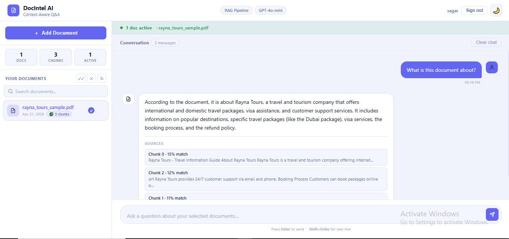
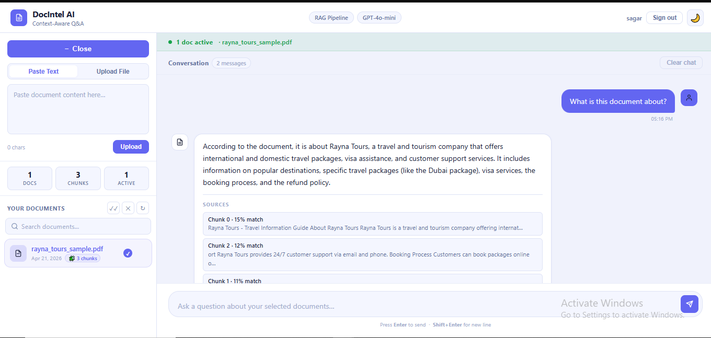

# Context-Aware Document Intelligence System


A production-ready **RAG (Retrieval-Augmented Generation)** system with JWT authentication, per-user document isolation, and conversation memory. Upload documents, ask questions, and get answers grounded strictly in your content — no hallucination. Built from scratch with Node.js and MySQL — **no vector database required**.

---

## Screenshots





---

## Features

- **JWT Authentication** — Register/login, tokens stored in localStorage, 7-day expiry
- **Per-user data isolation** — Every query scoped to `user_id`; users can never access each other's documents
- **Multi-document Q&A** — Select multiple documents; chunks compete on cosine similarity across all selected docs
- **Conversation memory** — Last 3 exchanges sent as history; AI understands follow-up questions and references
- **Custom vector search** — Cosine similarity in pure JavaScript (no Pinecone, no FAISS)
- **Similarity threshold** — Chunks below 0.1 score filtered before GPT sees them (prevents hallucination)
- **File upload support** — PDF, DOCX, and TXT processed in-memory via Multer (no disk writes)
- **Streaming responses** — Tokens stream to the UI in real-time via Server-Sent Events (SSE); no waiting for full response
- **Export chat** — Download the full conversation as a `.txt` file with one click (pure frontend, no server call)
- **Markdown rendering** — AI answers render bullet points, bold text, and code blocks
- **Rate limiting** — 20 req/15 min on `/ask`, 10 on uploads
- **Dark / light theme** — Fully themed two-panel chat interface

---

## Architecture

```
┌─────────────────────────────────────────────────────────────────┐
│                          UPLOAD PIPELINE                         │
│                                                                  │
│  File / Text  →  Extract Text  →  Chunk (500c, 100 overlap)     │
│                                       ↓                          │
│                               Embed each chunk                   │
│                          (text-embedding-3-small)                │
│                                       ↓                          │
│              Store in MySQL  ←  doc_session_id + user_id        │
│                  (content + JSON embedding)                      │
└─────────────────────────────────────────────────────────────────┘

┌─────────────────────────────────────────────────────────────────┐
│                          QUERY PIPELINE                          │
│                                                                  │
│  Question  →  Embed question  →  Load chunks (scoped to user)   │
│                                       ↓                          │
│                       Cosine Similarity score each chunk        │
│                                       ↓                          │
│                    Filter score < 0.1  →  discard               │
│                                       ↓                          │
│              Top 5 chunks + last 3 conversation turns           │
│                                       ↓                          │
│                        GPT-4o-mini  →  Answer + Sources         │
└─────────────────────────────────────────────────────────────────┘
```

---

## Tech Stack

| Layer          | Technology                          | Purpose                              |
|----------------|--------------------------------------|--------------------------------------|
| Runtime        | Node.js 22                           | JavaScript server runtime            |
| Framework      | Express 5                            | REST API routing                     |
| Database       | MySQL 8 + mysql2                     | Chunk and session storage            |
| Auth           | bcryptjs + jsonwebtoken              | Password hashing + JWT signing       |
| Embeddings     | OpenAI text-embedding-3-small        | 1536-dim vector generation           |
| Chat Model     | OpenAI gpt-4o-mini                   | Constrained answer generation        |
| File Parsing   | pdf-parse, mammoth                   | PDF and DOCX text extraction         |
| File Upload    | Multer (memory storage)              | In-memory file buffer — no disk I/O  |
| Rate Limiting  | express-rate-limit                   | API abuse prevention                 |
| Logging        | Morgan                               | HTTP request logging                 |
| Markdown       | marked (CDN)                         | Renders AI answers in the browser    |

---

## Project Structure

```
├── app/
│   ├── config/
│   │   ├── db.js                    # MySQL connection pool
│   │   └── openai.js                # Singleton OpenAI client
│   ├── middleware/
│   │   └── auth.middleware.js        # verifyToken — protects all AI routes
│   ├── models/
│   │   ├── document.model.js        # DB queries scoped to user_id
│   │   └── user.model.js            # findByEmail, createUser
│   ├── services/
│   │   ├── chunking.service.js      # Split text: 500 chars, 100 overlap
│   │   ├── embedding.service.js     # OpenAI embeddings call
│   │   ├── similarity.service.js    # Cosine similarity + threshold filter
│   │   ├── ai.service.js            # Prompt engineering + GPT call + history
│   │   └── fileParser.service.js    # PDF / DOCX / TXT text extraction
│   └── controllers/
│       ├── auth.controller.js       # register + login handlers
│       └── ai.controller.js         # Document and Q&A handlers
├── routes/
│   ├── auth.routes.js               # POST /api/auth/register, /login
│   └── ai.routes.js                 # All AI routes (protected by verifyToken)
├── public/
│   └── index.html                   # Full-stack chat UI (vanilla JS)
├── db/
│   └── schema.sql                   # MySQL schema (users + doc_sessions + documents)
├── index.js                         # Express entry point
└── .env.example                     # Environment variable template
```

---

## Getting Started

### 1. Clone the repository

```bash
git clone https://github.com/your-username/context-aware-document-intelligence.git
cd context-aware-document-intelligence
```

### 2. Install dependencies

```bash
npm install
```

### 3. Set up environment variables

```bash
cp .env.example .env
```

Fill in your `.env`:

```env
PORT=3000
JWT_SECRET=your_long_random_secret_here
OPENAI_API_KEY=sk-...your-openai-key...
DB_HOST=localhost
DB_USER=root
DB_PASSWORD=
DB_NAME=rag_chatbot
```

### 4. Set up the database

```bash
mysql -u root -p < db/schema.sql
```

### 5. Start the server

```bash
# Development (auto-restart on file changes)
npm run dev

# Production
npm start
```

Open `http://localhost:3000` — you will see the login screen. Register an account to get started.

---

## API Reference

All `/api/ai/*` routes require `Authorization: Bearer <token>` header.

### Auth

#### `POST /api/auth/register`
```json
{ "name": "John", "email": "john@example.com", "password": "secret123" }
```
```json
{ "token": "eyJ...", "user": { "id": 1, "name": "John", "email": "john@example.com" } }
```

#### `POST /api/auth/login`
```json
{ "email": "john@example.com", "password": "secret123" }
```
```json
{ "token": "eyJ...", "user": { "id": 1, "name": "John", "email": "john@example.com" } }
```

---

### Documents

#### `POST /api/ai/add`
```json
{ "content": "Your document text...", "title": "Optional title" }
```
```json
{ "success": true, "doc_session_id": 3, "chunks_stored": 6 }
```

#### `POST /api/ai/upload`
Multipart form-data, field name `file`, max 10MB. Accepts PDF, DOCX, TXT.
```json
{ "success": true, "doc_session_id": 4, "chunks_stored": 11 }
```

#### `GET /api/ai/documents`
```json
{ "documents": [{ "id": 3, "title": "HR Policy.pdf", "chunk_count": 11, "created_at": "..." }] }
```

#### `DELETE /api/ai/documents/:id`
```json
{ "success": true, "message": "Document deleted" }
```

#### `GET /api/ai/stats`
```json
{ "doc_count": 3, "chunk_count": 27 }
```

---

### Q&A

#### `POST /api/ai/ask`
Rate limited: 20 req / 15 min.
```json
{
  "question": "What is the annual leave policy?",
  "doc_session_ids": [3, 4],
  "history": [
    { "role": "user", "content": "What is this document about?" },
    { "role": "assistant", "content": "It covers HR policies for 2024..." }
  ]
}
```
```json
{
  "answer": "According to the document, employees are entitled to 20 days...",
  "sources": [
    { "chunk_index": 1, "score": 0.8742, "content": "Annual Leave: All full-time employees..." }
  ]
}
```

---

## Key Concepts

**Why no vector database?**
MySQL's `JSON` column stores embedding arrays and cosine similarity is computed in Node.js at query time. This demonstrates deep understanding of the underlying math. Production systems with millions of chunks would add FAISS or Pinecone for scale.

**User isolation**
Every `doc_session` has a `user_id` FK. All queries use `INNER JOIN doc_sessions ON ds.user_id = ?` — so even if a user manually sends a foreign `doc_session_id`, the JOIN returns zero rows. Security is enforced at the database level, not just the application level.

**Conversation memory**
The last 6 messages (3 exchanges) are sent to GPT on every request. The history is capped to keep token usage bounded — cost stays flat no matter how long the conversation gets. History resets when the user changes document selection or clears the chat.

**Cosine Similarity vs Euclidean Distance**
We care about the *direction* of a vector (what the text means), not its *magnitude* (how long the text is). Two chunks about the same topic produce vectors pointing in the same direction regardless of length.

**Chunking with Overlap**
Documents split into 500-character chunks with 100-character overlap. The overlap prevents information from being cut at a boundary and lost from both chunks.

**Prompt Engineering**
Eight rules constrain the LLM: answer only from context, use conversation history for follow-ups, say "I don't know" if the answer isn't there, no filler phrases, respond in the user's language. `temperature: 0.2` keeps answers focused.

---

## Future Enhancements

- **Redis caching** — Cache embeddings for repeated questions to cut API costs
- **Streaming responses** — OpenAI streaming API for real-time token output
- **FAISS / Pinecone** — Replace MySQL similarity search for large-scale deployments
- **Re-ranking** — Cross-encoder pass after cosine retrieval for higher accuracy
- **Chunk metadata** — Store page numbers and headings for richer source attribution

---

## License

MIT
