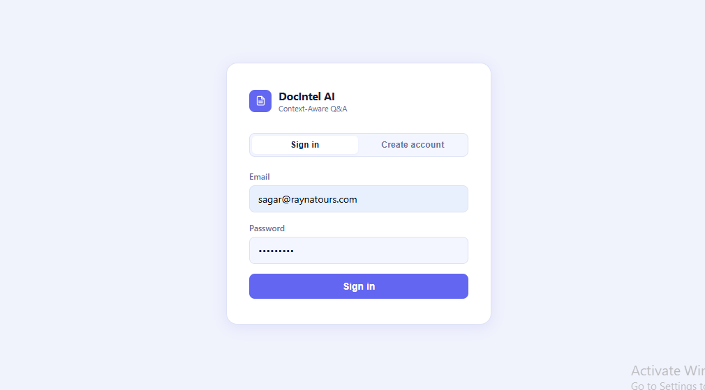
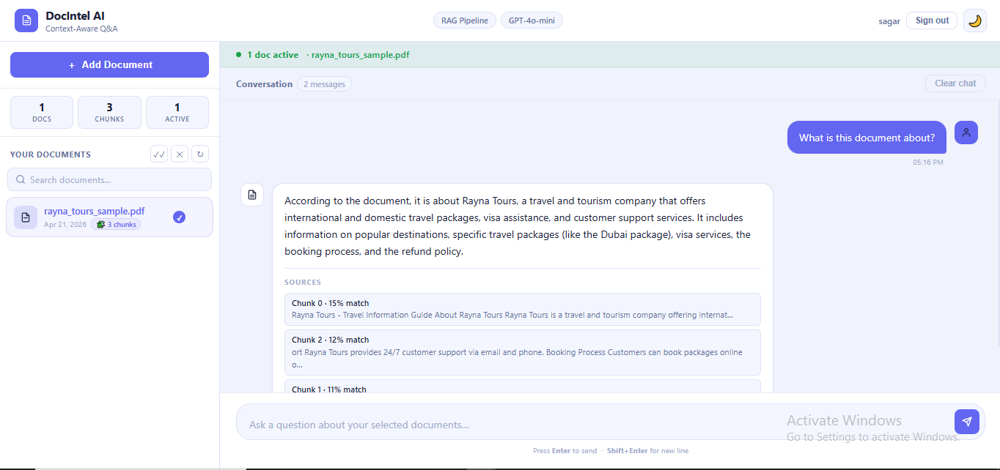
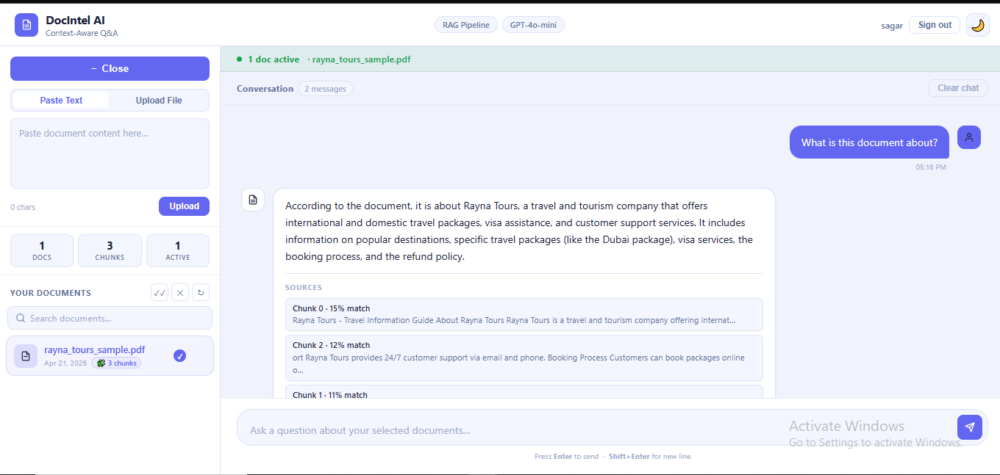

# Context-Aware Document Intelligence System


A production-ready **RAG (Retrieval-Augmented Generation)** system with JWT authentication, per-user document isolation, and conversation memory. Upload documents, ask questions, and get answers grounded strictly in your content — no hallucination.

Retrieval started as hand-written cosine similarity over MySQL `JSON` columns, scoring every chunk in a JavaScript loop. **v2 moves vectors to [Qdrant](https://qdrant.tech)** for HNSW indexing and server-side payload filtering. The original exact-search implementation is kept as the ground truth that the approximate index is measured against — see [`npm run benchmark`](#maintenance-scripts).

---

## Screenshots





---

## Features

- **JWT Authentication** — Register/login, tokens stored in localStorage, 7-day expiry
- **Per-user data isolation** — Every query scoped to `user_id`; users can never access each other's documents
- **Multi-document Q&A** — Select multiple documents; chunks compete on cosine similarity across all selected docs
- **Conversation memory** — Last 3 exchanges sent as history; AI understands follow-up questions and references
- **Qdrant vector search** — HNSW approximate nearest-neighbour index, Cosine distance, 1536 dimensions
- **Server-side filtering** — `user_id` and `doc_session_id` payload indexes push access control into the database instead of filtering in application code
- **Measured recall** — `npm run benchmark` reports recall@5 and latency for ANN vs exact search across a sweep of `ef` values
- **Rebuildable index** — source text is retained in MySQL, so `npm run reindex` recreates the entire collection after a chunking change or a lost cluster
- **Batched embedding** — chunks are embedded ~100 per request and mapped back by response index, not array position
- **File upload support** — PDF, DOCX, and TXT processed in-memory via Multer (no disk writes)
- **Streaming responses** — Tokens stream to the UI in real-time via Server-Sent Events (SSE); no waiting for full response
- **Export chat** — Download the full conversation as a `.txt` file with one click (pure frontend, no server call)
- **Markdown rendering** — AI answers render bullet points, bold text, and code blocks
- **Rate limiting** — 20 req/15 min on `/ask`, 10 on uploads
- **Dark / light theme** — Fully themed two-panel chat interface

---

## Architecture

```
┌─────────────────────────────────────────────────────────────────┐
│                          UPLOAD PIPELINE                         │
│                                                                  │
│  File / Text  →  Extract Text  →  Chunk (500c, 100 overlap)     │
│                       ↓                          ↓               │
│         MySQL: doc_sessions            Embed in batches of 100   │
│         (title, raw_text,               (text-embedding-3-small) │
│          chunk_count)                            ↓               │
│                 ↑                        Qdrant: upsert points   │
│         source of truth for              vector + payload        │
│            npm run reindex             { user_id, doc_session,   │
│                                          chunk_index, content }  │
└─────────────────────────────────────────────────────────────────┘

┌─────────────────────────────────────────────────────────────────┐
│                          QUERY PIPELINE                          │
│                                                                  │
│  Question  →  Embed question                                     │
│                       ↓                                          │
│         Qdrant HNSW search, top 5                                │
│         filter: user_id AND doc_session_id ∈ selected            │
│         (payload-indexed — filtering happens in the DB)          │
│                       ↓                                          │
│         Top 5 chunks + last 3 conversation turns                 │
│                       ↓                                          │
│                GPT-4o-mini  →  Answer + Sources                  │
└─────────────────────────────────────────────────────────────────┘
```

### Why the two stores are split

MySQL keeps users, password hashes and document metadata — the places where
foreign keys, cascades and transactions earn their keep. Qdrant holds chunk
text and the 1536-float vectors, where an ANN index and payload filtering do.

The trade is explicit: the old `INNER JOIN ... AND ds.user_id = ?` enforced
per-user isolation *structurally*, so a forged `doc_session_id` simply matched
nothing. Qdrant has no joins, so that guarantee becomes application code. It
lives in exactly one place — [`ownerFilter`](app/services/vectorStore.service.js)
— and every read and delete goes through it. There is likewise no cascade
across the two stores, so deleting a document removes its vectors first and
its row second: a failure then leaves the document intact rather than leaving
orphaned vectors that still surface as answer sources.

---

## Tech Stack

| Layer          | Technology                          | Purpose                              |
|----------------|--------------------------------------|--------------------------------------|
| Runtime        | Node.js 22                           | JavaScript server runtime            |
| Framework      | Express 5                            | REST API routing                     |
| Database       | MySQL 8 + mysql2                     | Users, document metadata, source text |
| Vector store   | Qdrant (HNSW, Cosine, 1536-dim)      | Chunk embeddings + payload filtering |
| Auth           | bcryptjs + jsonwebtoken              | Password hashing + JWT signing       |
| Embeddings     | OpenAI text-embedding-3-small        | 1536-dim vector generation           |
| Chat Model     | OpenAI gpt-4o-mini                   | Constrained answer generation        |
| File Parsing   | pdf-parse, mammoth                   | PDF and DOCX text extraction         |
| File Upload    | Multer (memory storage)              | In-memory file buffer — no disk I/O  |
| Rate Limiting  | express-rate-limit                   | API abuse prevention                 |
| Logging        | Morgan                               | HTTP request logging                 |
| Markdown       | marked (CDN)                         | Renders AI answers in the browser    |

---

## Project Structure

```
├── app/
│   ├── config/
│   │   ├── db.js                    # MySQL connection pool
│   │   ├── qdrant.js                # Qdrant client + collection constants
│   │   └── openai.js                # Singleton OpenAI client
│   ├── middleware/
│   │   └── auth.middleware.js        # verifyToken — protects all AI routes
│   ├── models/
│   │   ├── document.model.js        # DB queries scoped to user_id
│   │   └── user.model.js            # findByEmail, createUser
│   ├── services/
│   │   ├── chunking.service.js      # Split text: 500 chars, 100 overlap
│   │   ├── embedding.service.js     # OpenAI embeddings, batched
│   │   ├── vectorStore.service.js   # ALL Qdrant access — search, upsert, filters
│   │   ├── similarity.service.js    # Exact cosine search — benchmark ground truth
│   │   ├── ai.service.js            # Prompt engineering + GPT call + history
│   │   └── fileParser.service.js    # PDF / DOCX / TXT text extraction
│   └── controllers/
│       ├── auth.controller.js       # register + login handlers
│       └── ai.controller.js         # Document and Q&A handlers
├── routes/
│   ├── auth.routes.js               # POST /api/auth/register, /login
│   └── ai.routes.js                 # All AI routes (protected by verifyToken)
├── public/
│   └── index.html                   # Full-stack chat UI (vanilla JS)
├── db/
│   ├── schema.sql                   # MySQL schema (users + doc_sessions)
│   └── migrations/
│       └── 001_qdrant.sql           # v1 → v2 upgrade for an existing database
├── scripts/
│   ├── reindex.js                   # Rebuild the Qdrant collection from raw_text
│   └── benchmark.js                 # recall@5 + latency, ANN vs exact
├── index.js                         # Express entry point
└── .env.example                     # Environment variable template
```

---

## Getting Started

### 1. Clone the repository

```bash
git clone https://github.com/your-username/context-aware-document-intelligence.git
cd context-aware-document-intelligence
```

### 2. Install dependencies

```bash
npm install
```

### 3. Set up environment variables

```bash
cp .env.example .env
```

Fill in your `.env`:

```env
PORT=3000
JWT_SECRET=your_long_random_secret_here
OPENAI_API_KEY=sk-...your-openai-key...
DB_HOST=localhost
DB_USER=root
DB_PASSWORD=
DB_NAME=rag_chatbot
QDRANT_URL=https://your-cluster.region.provider.cloud.qdrant.io:6333
QDRANT_API_KEY=your_qdrant_api_key_here
```

### 4. Create a Qdrant cluster

A [Qdrant Cloud](https://cloud.qdrant.io) free cluster (1 GB RAM, 4 GB disk) is
enough for this project and needs no credit card. Create the cluster, then
generate an API key from its **API Keys** panel and copy both values into `.env`.

> The key dialog defaults to a **90-day expiry**. Set a longer one — an expired
> key fails with a 401 that looks nothing like the underlying cause.

Self-hosting instead works without any code change — point `QDRANT_URL` at
`http://localhost:6333` and leave `QDRANT_API_KEY` empty:

```bash
docker run -p 6333:6333 -v $(pwd)/qdrant_storage:/qdrant/storage qdrant/qdrant
```

The collection and its payload indexes are created automatically on first boot.

### 5. Set up the database

```bash
mysql -u root -p < db/schema.sql
```

Upgrading an existing v1 database instead:

```bash
mysqldump -u root rag_chatbot > backup_before_qdrant.sql   # embeddings are dropped
mysql -u root -p < db/migrations/001_qdrant.sql
```

### 6. Start the server

```bash
# Development (auto-restart on file changes)
npm run dev

# Production
npm start
```

Open `http://localhost:3000` — you will see the login screen. Register an account to get started.

---

## Maintenance scripts

### `npm run reindex`

Rebuilds the entire Qdrant collection from `doc_sessions.raw_text`. Uploaded
files are parsed in memory and never written to disk, so that column is the
only durable copy of a document — which makes this the recovery path if the
collection is lost (the Qdrant free tier suspends idle clusters after a week
and deletes them after four), and the way to apply a chunking change to
documents that were already indexed.

Point IDs are a UUIDv5 of `(doc_session_id, chunk_index)`, so re-indexing
overwrites in place instead of inserting duplicates. Each document's points are
cleared first, because a larger `CHUNK_SIZE` yields fewer chunks and the
leftover high-index points would otherwise survive.

Re-embeds every chunk through OpenAI, so it costs money.

### `npm run benchmark`

Measures the approximate index against exact search.

```
ef      recall@5    median ms
--------------------------------
exact   1.000       ...
16      ...         ...
32      ...         ...
64      ...         ...
128     ...         ...
256     ...         ...
```

Exact search examines every vector, so its top-5 is correct by definition and
serves as ground truth. **recall@5** is the share of that true top-5 the HNSW
index also returned; **ef** is the size of the candidate list HNSW keeps while
walking the graph — larger explores more, trading latency for recall. It is a
per-query parameter, so it tunes without rebuilding the index.

Queries are sampled from the stored chunks themselves, which gives realistic
inputs with known-relevant answers and avoids hand-picked questions that
flatter the index.

On a small collection exact search still wins on latency and recall is
trivially 1.000 — everything fits in the candidate list. The curve only becomes
interesting with a real corpus, which is the point: exact search is O(n) and
degrades with every document added, while HNSW is roughly O(log n).

---

## API Reference

All `/api/ai/*` routes require `Authorization: Bearer <token>` header.

### Auth

#### `POST /api/auth/register`
```json
{ "name": "John", "email": "john@example.com", "password": "secret123" }
```
```json
{ "token": "eyJ...", "user": { "id": 1, "name": "John", "email": "john@example.com" } }
```

#### `POST /api/auth/login`
```json
{ "email": "john@example.com", "password": "secret123" }
```
```json
{ "token": "eyJ...", "user": { "id": 1, "name": "John", "email": "john@example.com" } }
```

---

### Documents

#### `POST /api/ai/add`
```json
{ "content": "Your document text...", "title": "Optional title" }
```
```json
{ "success": true, "doc_session_id": 3, "chunks_stored": 6 }
```

#### `POST /api/ai/upload`
Multipart form-data, field name `file`, max 10MB. Accepts PDF, DOCX, TXT.
```json
{ "success": true, "doc_session_id": 4, "chunks_stored": 11 }
```

#### `GET /api/ai/documents`
```json
{ "documents": [{ "id": 3, "title": "HR Policy.pdf", "chunk_count": 11, "created_at": "..." }] }
```

#### `DELETE /api/ai/documents/:id`
Removes the chunks from Qdrant first, then the session row from MySQL — there is
no cascade between the two stores. Returns `404` if the id does not exist or
belongs to another user.
```json
{ "success": true, "message": "Document deleted" }
```

#### `GET /api/ai/stats`
```json
{ "doc_count": 3, "chunk_count": 27 }
```

---

### Q&A

#### `POST /api/ai/ask`
Rate limited: 20 req / 15 min.
```json
{
  "question": "What is the annual leave policy?",
  "doc_session_ids": [3, 4],
  "history": [
    { "role": "user", "content": "What is this document about?" },
    { "role": "assistant", "content": "It covers HR policies for 2024..." }
  ]
}
```
```json
{
  "answer": "According to the document, employees are entitled to 20 days...",
  "sources": [
    { "chunk_index": 1, "score": 0.8742, "content": "Annual Leave: All full-time employees..." }
  ]
}
```

---

## Key Concepts

**Exact search vs approximate (ANN)**
v1 scored every stored chunk in a JavaScript loop — correct by definition, but O(n): each new document made every question slower. Qdrant's HNSW index walks a navigable small-world graph and examines a fraction of the collection, roughly O(log n), at the cost of *sometimes* missing a true nearest neighbour. That trade is the reason vector databases exist, and `npm run benchmark` measures it here rather than assuming it.

**`ef` — the recall/latency dial**
`hnsw_ef` is how many candidates HNSW keeps while searching. Higher explores more of the graph: better recall, slower queries. It is a per-query parameter, so it tunes without rebuilding the index — which is why the benchmark sweeps it instead of reporting a single number.

**Why keep the exact implementation?**
Recall is meaningless without ground truth. [`similarity.service.js`](app/services/similarity.service.js) still scores every vector by hand, and its top-5 is what the approximate results are graded against.

**User isolation — and what the migration cost**
v1 enforced this *structurally*: every query ran `INNER JOIN doc_sessions ON ds.user_id = ?`, so a forged `doc_session_id` matched zero rows no matter what the application did. Qdrant has no joins, so the same guarantee is now a payload filter — application code that can be forgotten.

It therefore lives in exactly one function, [`ownerFilter`](app/services/vectorStore.service.js), which **throws** rather than defaulting when `userId` is missing, and every read and delete goes through it. There is no cross-store cascade either, so deleting a document removes its vectors *before* its row: a failure leaves the document intact rather than leaving orphaned vectors that still surface as answer sources.

This is the general shape of the trade — MySQL was enforcing correctness for free through foreign keys, cascades and joins; a vector database enforces none of it, and each guarantee becomes code you write and verify.

**Why MySQL is still here**
Users, password hashes and document metadata stay relational, where `UNIQUE` constraints, foreign keys and transactions earn their keep. `doc_sessions.raw_text` also holds the extracted source text — uploads are parsed in memory and never written to disk, so it is the only durable copy and the thing `npm run reindex` rebuilds from.

**Conversation memory**
The last 6 messages (3 exchanges) are sent to GPT on every request. The history is capped to keep token usage bounded — cost stays flat no matter how long the conversation gets. History resets when the user changes document selection or clears the chat.

**Cosine Similarity vs Euclidean Distance**
We care about the *direction* of a vector (what the text means), not its *magnitude* (how long the text is). Two chunks about the same topic produce vectors pointing in the same direction regardless of length.

**Chunking with Overlap**
Documents split into 500-character chunks with 100-character overlap. The overlap prevents information from being cut at a boundary and lost from both chunks.

**Prompt Engineering**
Eight rules constrain the LLM: answer only from context, use conversation history for follow-ups, say "I don't know" if the answer isn't there, no filler phrases, respond in the user's language. `temperature: 0.2` keeps answers focused.

---

## Future Enhancements

- **Hybrid search** — Combine keyword (BM25) and vector scores via Reciprocal Rank Fusion, so exact terms like invoice numbers and product codes are matched as reliably as meaning
- **Re-ranking** — Cross-encoder pass over the top candidates for higher precision than similarity alone
- **Query rewriting** — Rewrite follow-ups into standalone questions before embedding; "what about that one?" carries almost no meaning as a vector
- **Sentence-aware chunking** — Split on sentence and paragraph boundaries instead of a fixed 500 characters
- **Chunk metadata** — Store page numbers and headings for richer source attribution
- **Quantization** — Scalar or binary quantization in Qdrant to cut vector memory 4–32× at a measurable recall cost
- **Redis caching** — Cache embeddings for repeated questions to cut API costs

---

## License

MIT
